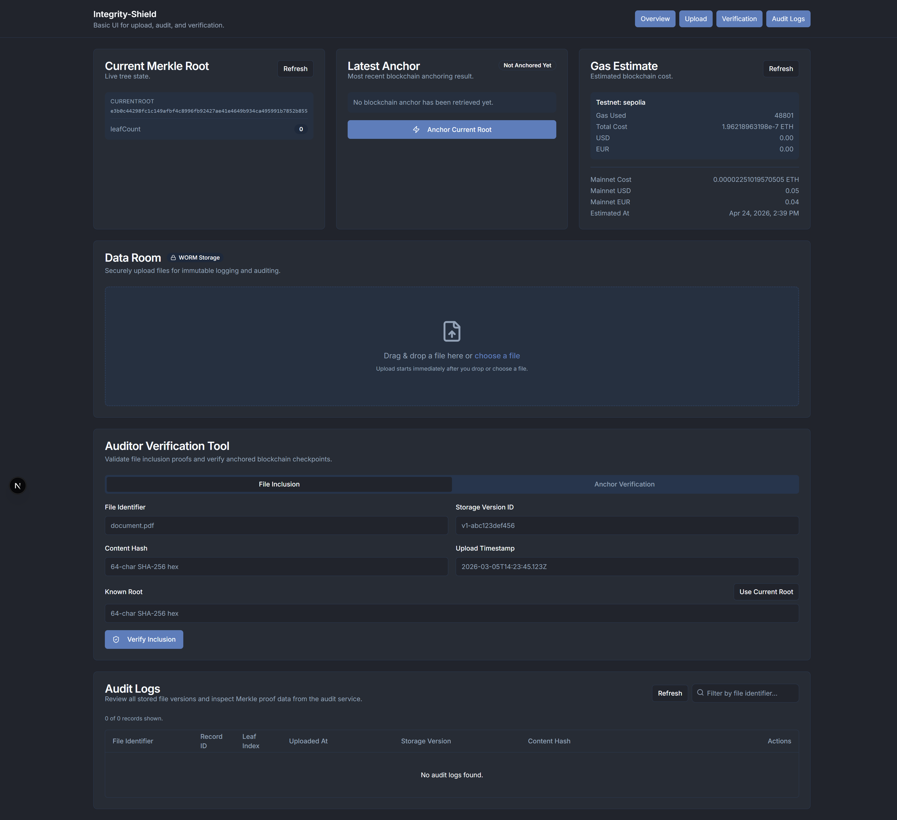
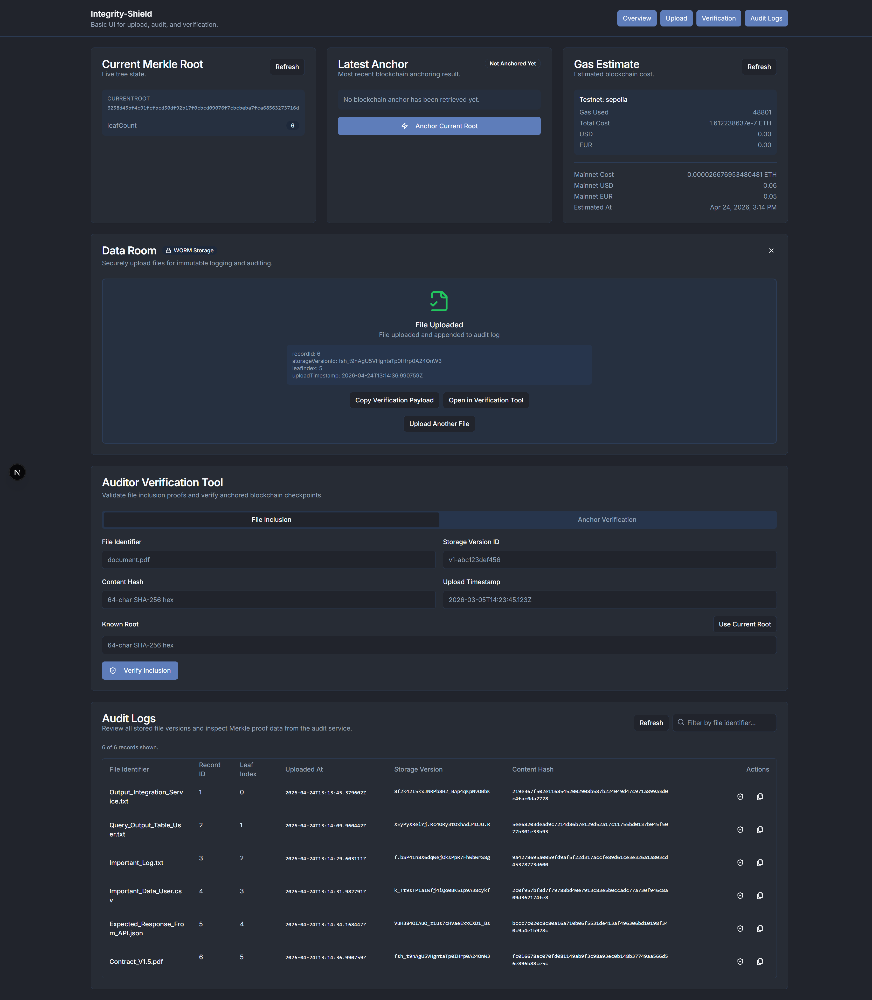
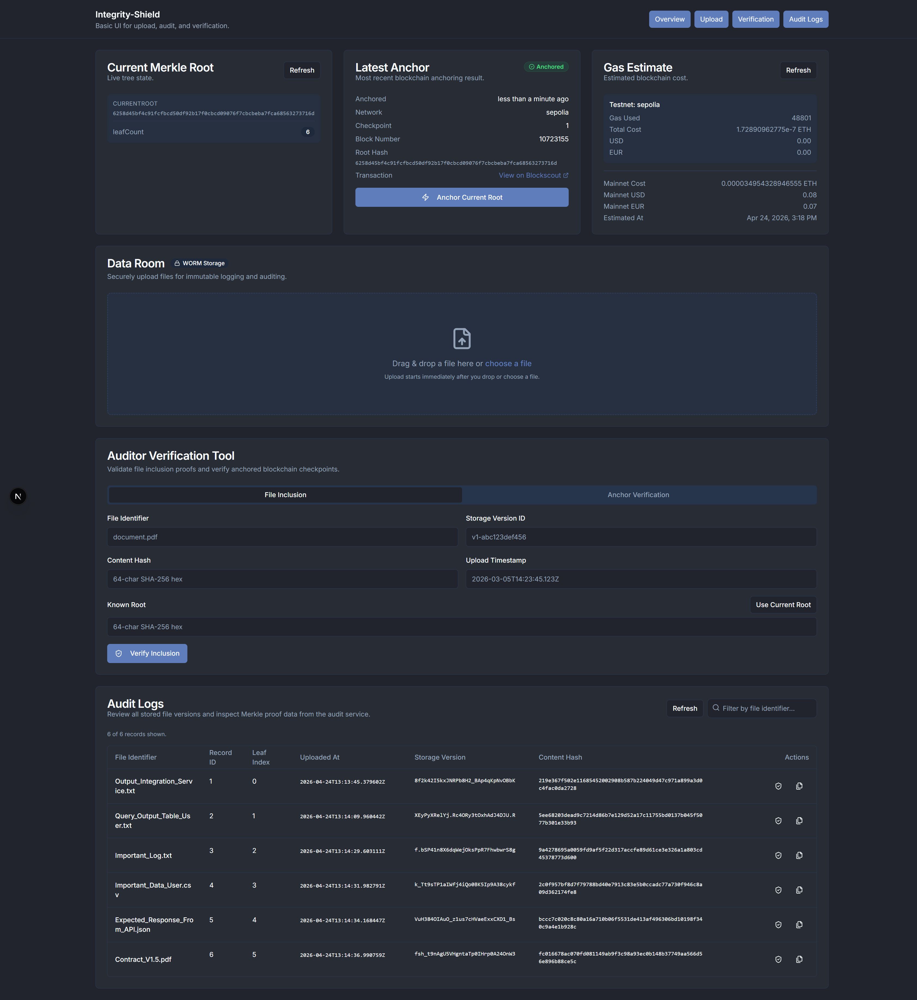
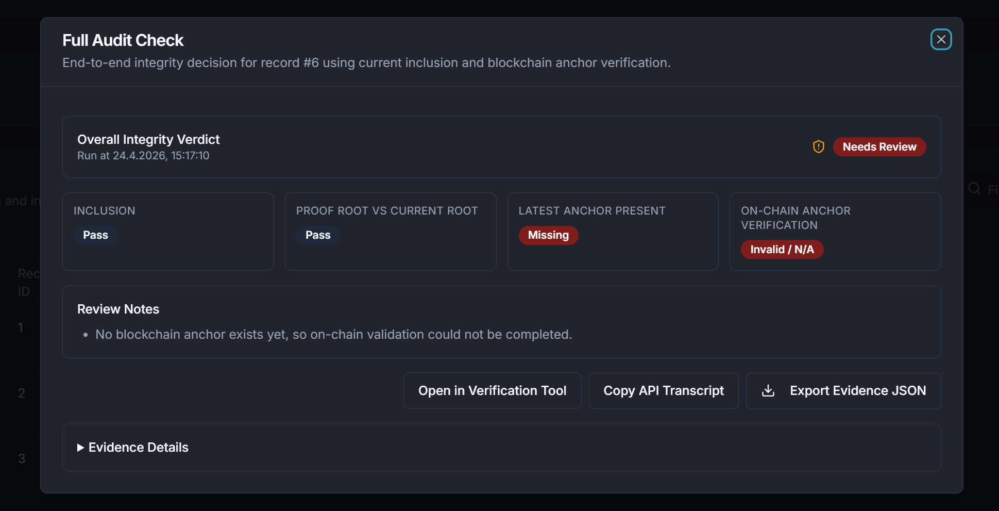
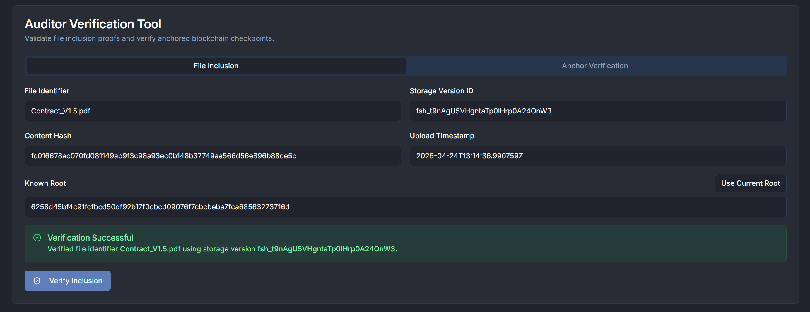
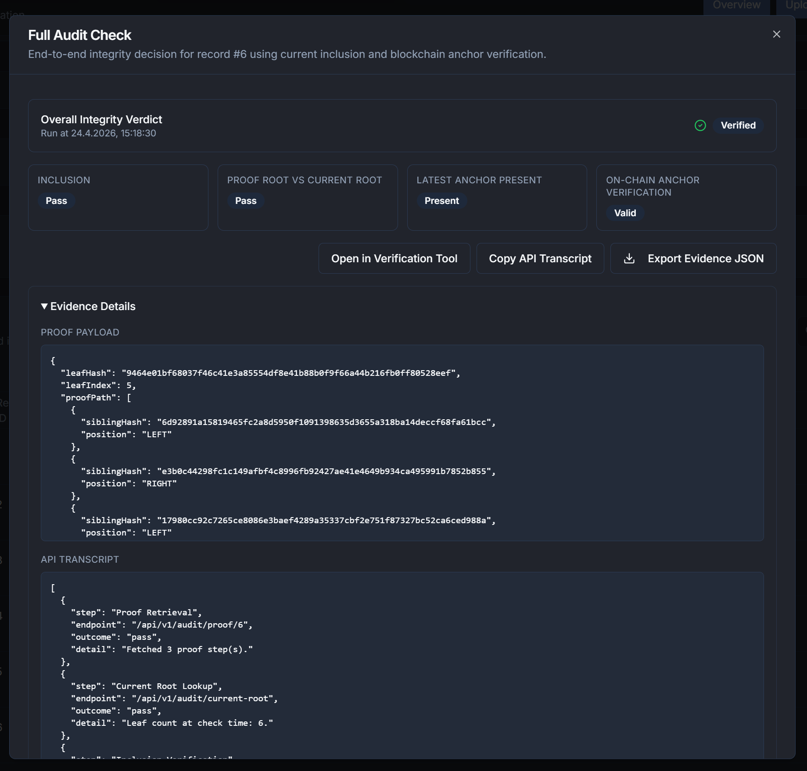

# Integrity Shield

Integrity Shield is a platform focused on protecting data integrity through a dedicated backend service and a user-facing web interface.

This work was developed as part of a master's thesis within the master's studies at FH Technikum.

This repository contains the overall project context and supporting materials. The main implementation is split into:

- API: backend logic and service layer for Integrity Shield
- UI: frontend application for interacting with the platform

Both the API and UI include their own README files with setup, configuration, and usage details.

## UI Preview

A compact visual overview of the main UI flow is available below.

> Note: For screenshots to render on GitHub, image files must be committed to this repository (or hosted at a stable public URL).

Show UI screenshots

	
	
	

	
	
	

## Documentation

For component-specific instructions, please refer to the README files in the respective API and UI directories.
